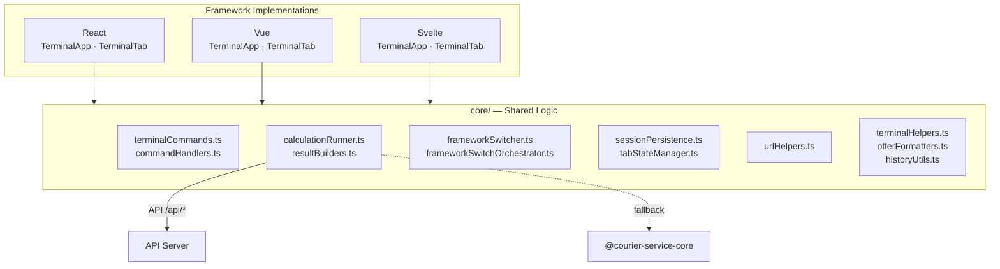
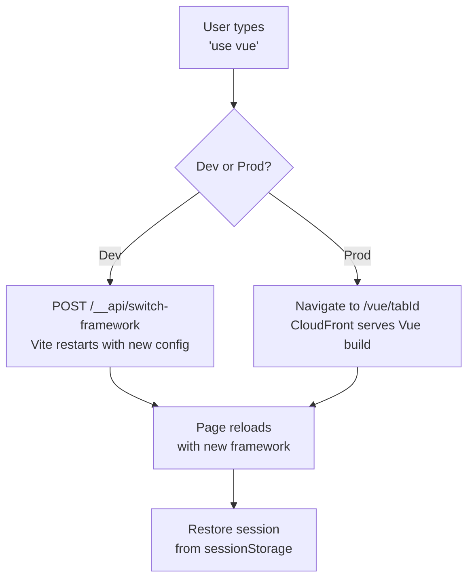
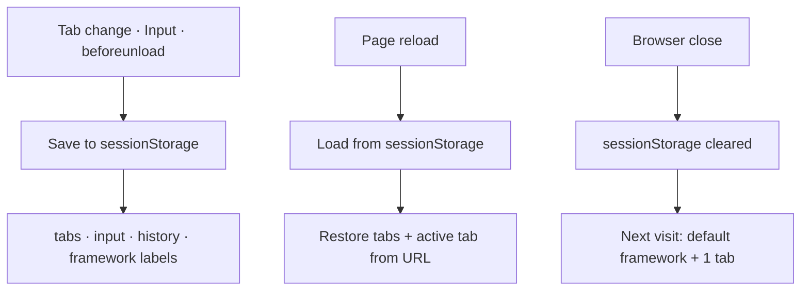

# @nurulizyansyaza/courier-service-frontend

Multi-framework frontend dashboard for the **Courier Service** App Calculator. Supports React, Vue and Svelte with hot swappable framework switching.

## Setup

### Prerequisites

- **Node.js** 18 or 20 — check with `node --version`
- **npm** — check with `npm --version`
- **courier-service-core** must be built first (see below)

### Step 1 — Build the core library first

The frontend depends on the core library. If you haven't built it yet:

```bash
cd courier-service-core
npm install
npm run build
cd ..
```

### Step 2 — Install dependencies

```bash
cd courier-service-frontend
npm install
```

### Step 3 — Start the dev server

```bash
npm run dev
```

Open your browser and go to `http://localhost:5173`.

> **Tip:** The frontend works without the API running — it falls back to local calculations using the core library.

### Using with the API (optional)

If you want the frontend to connect to the API, you need **two terminals**:

**Terminal 1** — Start the API:

```bash
cd courier-service-api
npm run dev
```

**Terminal 2** — Start the frontend:

```bash
cd courier-service-frontend
npm run dev
```

The frontend automatically proxies `/api/*` requests to `http://localhost:3000`. If the API is unreachable, calculations fall back to local mode.

### Step 4 — Run the tests

```bash
npm test
```

You should see all **248 tests** pass across **18 test suites**.

## Architecture

The frontend provides a terminal-style UI where users input package data and receive cost/delivery time calculations. It supports three frameworks sharing a common core:

### Terminal Commands

| Command | Description |
|---------|-------------|
| `/change use react \| vue \| svelte` | Switch framework |
| `/change mode cost \| time` | Switch calculation mode |
| `clear` | Clear screen (scroll up to see history) |
| `/restart` | Show welcome screen again |
| `help` | Show available commands |
| `exit` | Exit and reset terminal |
| `/connect` | Reconnect after exit |
| `↑` / `↓` | Navigate through previous command history |
| `Ctrl+C` | Clear current input |

### Error Display

Error messages are displayed with line breaks — each error appears on its own line with a bullet prefix (•) and spacing between them, rather than as a single block of text.

Errors are validated **line by line** — only the first problematic line's errors are shown, so you can fix one thing at a time. Typo'd commands (e.g., `hlp`, `clera`, `/connec`) are detected and suggest the closest matching command.

### Command History

The terminal supports **real CLI-style command history navigation** using the up/down arrow keys:

- **↑ Arrow** — Recall the previous command (press repeatedly to go further back)
- **↓ Arrow** — Move forward through history (clears input at the bottom, showing placeholder)
- **Ctrl+C** — Clear the current input and reset history cursor
- **Edit-aware cursor** — If you recall a command with ↑ then edit or delete text, the cursor resets so the next ↑ starts fresh from the most recent command
- **Per-tab isolation** — Each terminal tab maintains its own independent command history
- **Persistent storage** — History is stored in `localStorage`, so it survives exit, restart, connect, closing the browser tab, and closing the browser entirely
- **50 command cap** — Oldest commands are pruned automatically
- **Deduplication** — Consecutive duplicate commands are stored only once

```
src/
  core/               # Shared logic (framework-agnostic)
    calculationRunner.ts  # API-first runner with local fallback
    resultBuilders.ts     # Shared result/history/tab-update builders
    commandHandlers.ts    # Individual command handler functions
    commandHistory.ts     # Per-tab command history (localStorage, ↑/↓ navigation)
    terminalCommands.ts   # Command dispatcher (routes to handlers)
    frameworkSwitcher.ts  # Framework switching (dev + production)
    frameworkSwitchOrchestrator.ts  # Shared switch-framework orchestration
    tabStateManager.ts    # Tab state management
    sessionPersistence.ts # sessionStorage save/load + patchTabUIState
    urlHelpers.ts         # URL parsing/sync (/<framework>/<tabId>)
    helpTextParser.ts     # Terminal help text parser
    historyUtils.ts       # Command history utilities
    offerFormatters.ts    # Offer display formatting
    terminalHelpers.ts    # Sort, discount, scroll, resize helpers
    constants.ts          # Shared constants (DEFAULT_FRAMEWORK, etc.)
    types.ts              # Shared TypeScript types
    utils.ts              # Re-exports (backward compatibility)
  react/              # React implementation
  vue/                # Vue implementation
  svelte/             # Svelte implementation
```

### Component Architecture



### Framework Switching



**Dev mode** — switch frameworks at runtime via the terminal UI (`use vue`) or API:

```bash
# Via Vite dev server API
curl -X POST http://localhost:5173/__api/switch-framework \
  -H 'Content-Type: application/json' \
  -d '{"framework": "vue"}'

# Or via npm scripts
npm run use:react
npm run use:vue
npm run use:svelte
```

Or edit `framework.config.json`:
```json
{ "framework": "react" }
```

**Production mode** — all three frameworks are deployed simultaneously to S3 at `/react/`, `/vue/`, `/svelte/`. The `use <framework>` command navigates the user's browser to the corresponding URL. Framework switching is **per-user** — each user independently chooses their framework without affecting others.

### URL Routing

The URL reflects both the active terminal tab and its associated framework:

```
/<framework>/<tabId>
```

For example, if a user has two terminal tabs — tab `1` on React and tab `2` on Vue:

| Active tab | URL |
|---|---|
| tab 1 (React) | `/react/1` |
| tab 2 (Vue) | `/vue/2` |

Tab IDs are sequential integers (1, 2, 3, …) for clean, readable URLs.

- **Tab switch** — updates the URL via `history.replaceState` (no page reload). The framework segment changes to match the selected tab's framework.
- **Framework switch** — navigates to `/<new-framework>/<tabId>` (full page load to serve the correct build). Only the active terminal tab's framework label is updated; other tabs retain their original labels. The tab's framework is explicitly persisted to `sessionStorage` via `patchTabUIState` before navigation, avoiding race conditions with Vite server restart.
- **Page reload** — in production, CloudFront serves the correct framework build based on the URL prefix. The tab ID from the URL is used to restore the correct active tab from `sessionStorage`. Each tab's framework label is restored independently from the persisted session.
- **Fresh session (browser close → reopen)** — `sessionStorage` is cleared when the browser closes, so a new session starts with the default framework (`react`) and one tab. If the URL or dev server was left on a non-default framework, the app automatically resets by switching back to the default.

### Session Persistence



Session state (tabs, input data, command history) is saved to `sessionStorage` and restored on page reload. Using `sessionStorage` (rather than `localStorage`) ensures session data clears when the browser or tab is closed, preventing stale data from surviving a browser restart.

- State is saved on every tab change and before the page unloads (`beforeunload`)
- The `beforeunload` handler persists the correct per-tab framework so the label matches the URL after reload
- `patchTabUIState(tabId, state)` explicitly writes a single tab's UI state to `sessionStorage` before framework navigation — this avoids a race condition where the Vite server restart or page unload could happen before the `beforeunload` handler fires
- Command history is capped at 200 entries per tab
- Closed tab UI states are pruned to prevent unbounded storage growth
- Each terminal tab independently tracks its own framework — switching framework on one tab does not affect others
- On fresh session init (no `sessionStorage` data), the app pre-saves a default session and redirects to `DEFAULT_FRAMEWORK` (`react`) if the current build/URL differs

## API Integration

The frontend uses a dual-mode calculation strategy:

1. **API mode** (primary) — Sends requests to `/api/cost` and `/api/delivery/transit` endpoints, benefiting from server-side rate limiting and validation
2. **Local mode** (fallback) — If the API is unreachable, calculations run client-side using the core library directly

### Vite Proxy

In development, `/api/*` requests are proxied to the API server:

```
Frontend (localhost:5173) → Proxy → API (localhost:3000)
```

To use API mode, start both servers:

```bash
# Terminal 1: API server
cd ../courier-service-api && npm run dev

# Terminal 2: Frontend
npm run dev
```

The app works without the API running — calculations fall back to local mode automatically.

## Testing

```bash
npm test
```

You should see all **248 tests** pass across **18 test suites**.

Tests use BDD-style naming (`describe('when [scenario]') / it('should [behavior]')`) and cover:

- **Core modules** — command handlers, command history navigation, calculation runner, result builders, session persistence, tab state, URL helpers, framework switching, terminal helpers
- **Component tests** — TerminalApp tab management, session restore, UI interactions
- **Edge cases** — quota exceeded, malformed JSON, division by zero, scroll boundaries

Tests mock `fetch` to simulate API unavailability, verifying local fallback behavior.

## CI/CD

GitHub Actions workflow (`.github/workflows/ci.yml`) runs on push/PR to `main`:

1. **Test** — checks out `courier-service-core`, builds it, then runs type-check, tests, and production build
2. **Trigger Staging Deploy** — on push to `main`, triggers a staging deploy on [`courier-service`](https://github.com/nurulizyansyaza/courier-service), which triggers the staging deployment pipeline

Requires a `DEPLOY_TRIGGER_TOKEN` secret (fine-grained PAT with Actions + Contents write access on the `courier-service` repo).

## Build

```bash
npm run build   # produces dist/ for production deployment
```
